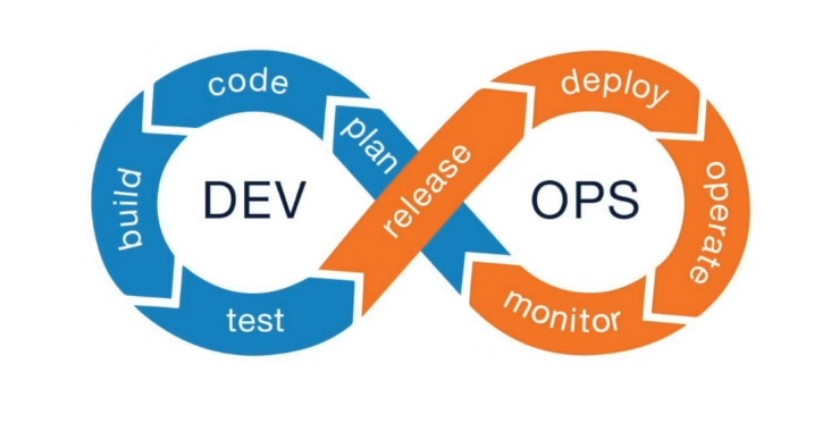

# Lesson 1: What is DevOps?

### Devops Definition: A methodology that helps engineering teams build products by continuously getting user feedback

 

- Plan: Take a set of features of you want to build and work with a team to make them
- Code: Developers build out the features
- Build: Take code and bundle it for users to run
- Test: Both automatic (continuous integration) and manual (quality assurance)
- Release: Take software and send to users without them noticing any problems
- Deploy: Build is publically accessible 
- Operate: Making sure there are enough resources for things like load/ Architecture
- Monitor: As users use the app, we make sure everything's healthy

### DevOps Engineering Definition: Practical use of DevOps within software engineering teams. Being able to build, test, release and monitor applications. 

## DevOps Engineering Pillars

- ### Pull Request Automation
    - Helps developers build things faster
- ### Deployment Automation
    - Helps deploy in a way where users won't complain
- ### Application Performance Management
    - Automation around making sure things are healthy

## Pull Request Automation

- Developers share code changes using git tools like GitHub, GitLad, and Bitbucket
- A set of code changes in git tools is called a "pull request" or "merge request"
- If pull requests are approved, the code changes can go into the main codebase

### Git definition
Git is used for cloud-based code change collaboration. See the full history of code changes, review developer changes, and store code in files called repositories. 

## What can you automate?
- Continuous Integration (CI)
- Per change ephemeral environments
- Automated security scanning
- Notifications to reviewers

## Goal as a DevOps Engineer
Help developer change proposals get reviewed and merged within 24 hours of when they are made. 

## Deployment Automation
- Deploy a feature to a certain set of users as a final test before rolling it out publically 
- Starting new versionf of servives without causing downtime
- Rolling back to the prior version in case something does go wrong

It's easy to overcomplicate deployments

## Goal as a DevOps Engineer
Have the right tools in place that facilitate deployment without having to have too much custom code.  

## Application Performance Management
- Metrics: numeric measurements of key numbers in production
- Logging: text descriptions of what is happening during processing
- Monitoring: take metrics and logs to convert them into health metrics
- Alerting: if monitoring detects a problem, it notifies developer

- Terraform lets you automate a deployment process
    - ensures the right things are running in the right places

## DevOps Engineering is vital for engineering teams, especially as the product matures

