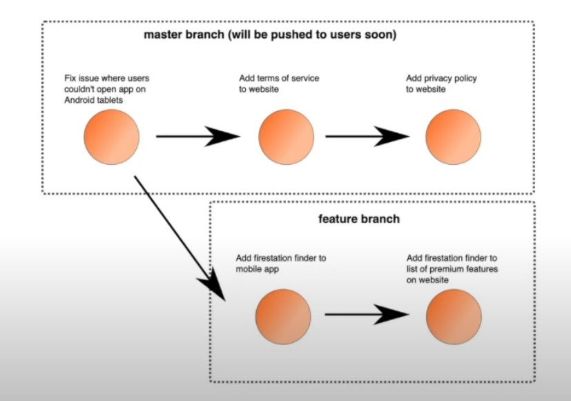

# Lesson 3: What is CI?

## CI: Continuous Integration
Developers pushing many small changes to a central git repository per day. These changes are verified by an automatic software that runs comprehensive tests to ensure no major issues are seen by customers. 

## Top 3 Benefits of CI: 
- CI is the first step to DevOps automation and helps with code collaboration
- CI helps improve developer speed without breaking existing code
- CI helps reduce customer churn and user satisfaction by preventing broken code from publishing

Common workflow:

## CI is a vital tool for developer collaboration. Increase collaboration, prevent errors, and increase user satisfaction

Side note: look up LayerCI -> can install it on a repo on all popular git sites
  