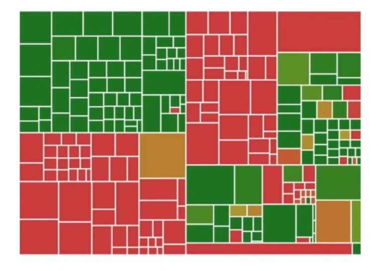

# Lesson 4: What is Code Coverage?

## Code Coverage Definition
Methodology that quantitatively measures how comprehensive a code base's tests are. Increasing code coverage often increases stability and reduces bugs. 

e.g. Imagine you're working with a huge code base w/ 100,000 lines of code


Code coverage graph, each square represents a file, the more green, the more that's covered

A simple/contrived JS example:

```js
let f = n =>{
    let x = "hello", result = [];
    for (let i = 0; i < n; i++){
        result.push(x+i);
        if(i%50 === 49){
            result.push("50th: "+x+i);
        }
    }
    return result;
}
```

There are 3 kinds of lines in this code

1) Syntax lines
    - e.g. the brackets, they don't have any logic
2) Logic Lines
    - has side effects
3) Branch lines
    - change the flow of the program

## Code Coverage Formula = Total # of non-syntax lines with tests/Total # of non-syntax lines


```
it ("should work for two", () =>{
    let expected = ["hello0", "hello1"];
    assertEquals(f(2), expected);
})
```

There are six lines of actual code in the function, so 5/6 = 83% test coverage

<hr>

## Branch Coverage Definition
A very relevant concept to code coverage is "branch coverage" - instead of measuring how many lines of code, it measures groups of lines. 

So with the above test, the branch coverage would be 2/3 so it has 66% code coverage

<hr>

## When to care about code coverage
- Your product has users and those users might leave if they are affected by bugs
- You are working with developers that aren't immediately trustworthy like contractors/interns
- You are working on a very large code base with many testable components

### Common Mistake: too may tests for uncertain features

<hr>

## Common policies for code coverage:

1) Code coverage must not decrease
2) code owners for test files

example code: 

```
*.spec.js @engineering-manager-username
```

If you are working in a large code base using TDD, hiring interns/contractors or have users sensitive to bugs, it's time to measure code coverage   