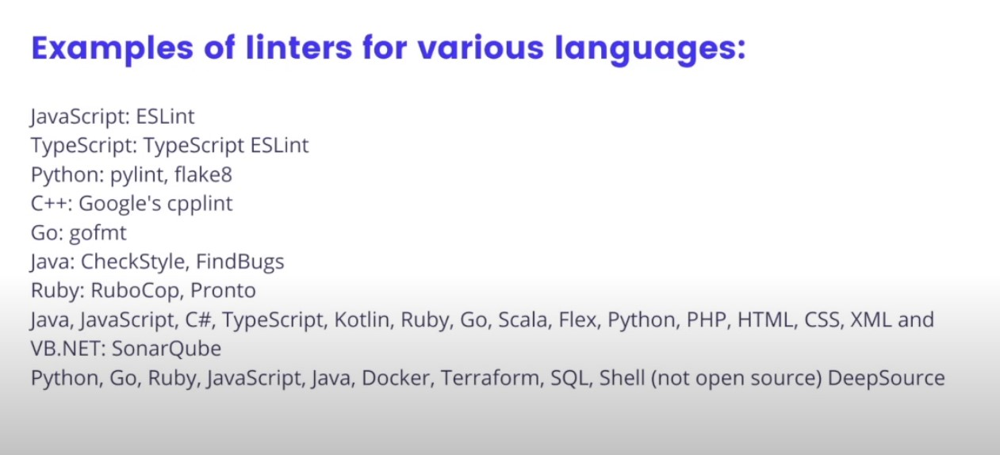

# Lesson 5: Linting Best Practices

## Linting Definition

Linters look at a program's source code and find problems automatically. They are a common feature of pull request automation because they ensure that "obvious" bugs do not make it to production. 

e.g.

```js
var x= 5;
function f(elements){console.log(elements)
let x = 0;
while(x<00){
    console.log(x)}
}
```

there are rules like 

"don't shadow variables"

## Don't waste time on style code review like:

"tabs or spaces?"

"camelCase or pothole_case?"

## The Nit Approach Definition

Code reviewers leave little comments on the code called "nits" that the team can ignore until broader reviews. Nits are helpful as future references but prevent blocking important changes

## Auto Formatter Definition

Tools that help apply code style rules based on the style guide your team has chosen automatically. 

e.g.
```go
find -name '.go' -not -path "/vendor/*" -exec gofmt -s -w {};
```

## Linting automatically in CI:

Developers should never wait for a human reviewer to let them know if their code is linted and styled correctly. Cheap and convenient to run linting and formatting within CI steps. 

## No merging if linting fails
```
COPY . .
RUN npm run lint
```



## Any team with more than one developer working in the same codebase should setup a linter to catch obvious bugs