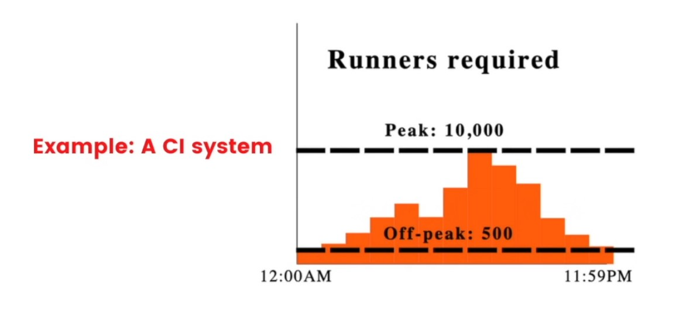

# Lesson 10: What is autscaling?

## Autscaling Definition
Autoscaling automates horizontal scaling to ensure that the number of workers is proportional to the load on the system.

example CI system

Let's say you're building a CI system, your users would push code, you'd spin up runners to test, and you'd see bursts of traffic during business hours. 

In an ideal world, you'd be able to create and destroy these runners as necessary. 

It's only possible to create and destroy workers because of cloud providers

At their enormous scale, it's possible to offer servers for cheap on small 1 hour leases. 

The most popular technology right now is **AWS EC2 Spot Instances**

as well as **Kubernetes horizontal pod autoscaling**

If you're using **Microsoft Azure**, you have Azure VMs/Containers

## Serverless vs Autoscaling
Autoscaling is usually discussed on the timeline of ~1 hour chunks of work. If you took the concept of autoscaling and took it to its limit, you'd get serverless: define resources that are quickly started, and use them on the timeline of ~100ms.

e.g. (serverless) a webserver might not need to exist at all until a user visits the page

## Use case for serverless
Serverless is primarily used for services that are somewhat fast to start, and stateless. You wouldn't run something like a CI run within a serverless framework, but you might run something like a webserver or notification service. 

## Prediction for serverless
Within a few years it's likely that serverless and autoscaling will converge into a single unified interface.