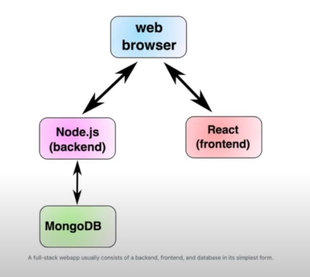
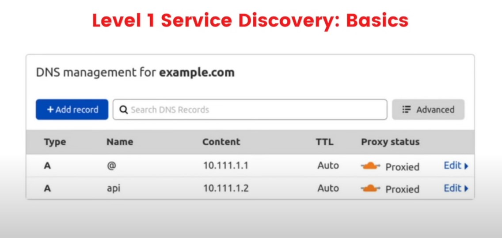
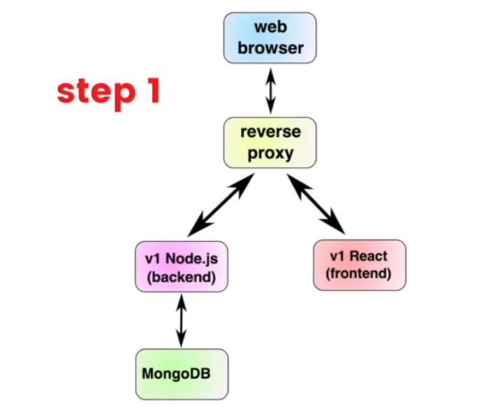
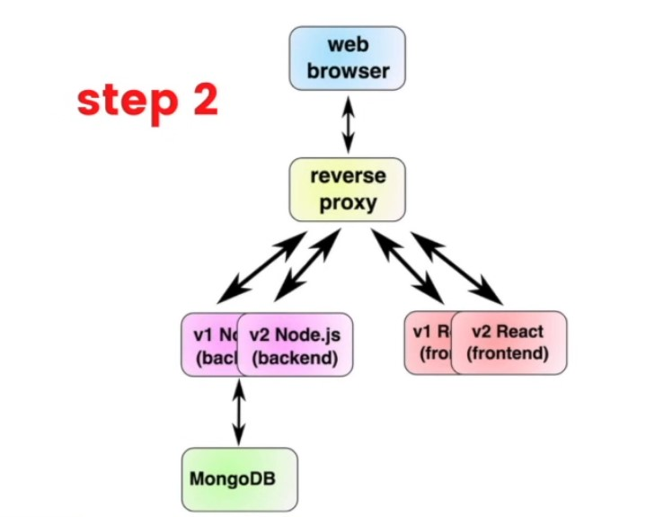
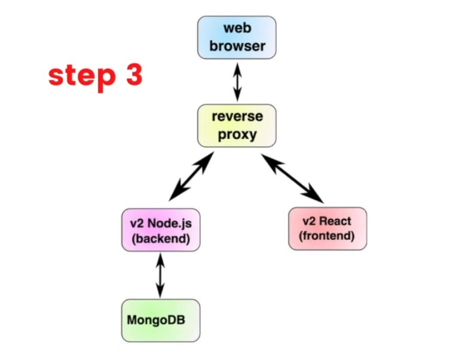
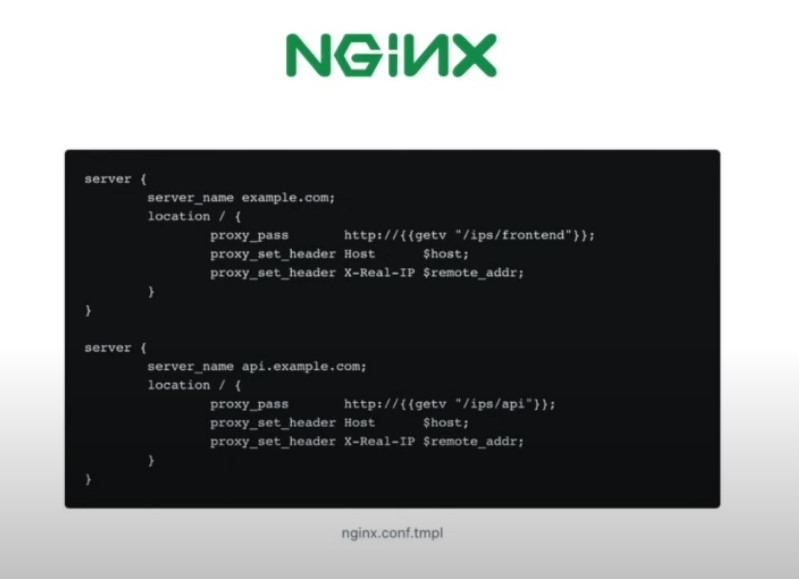
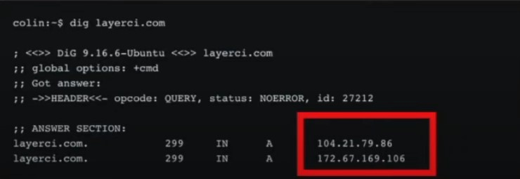
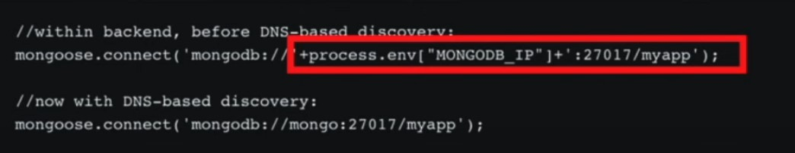
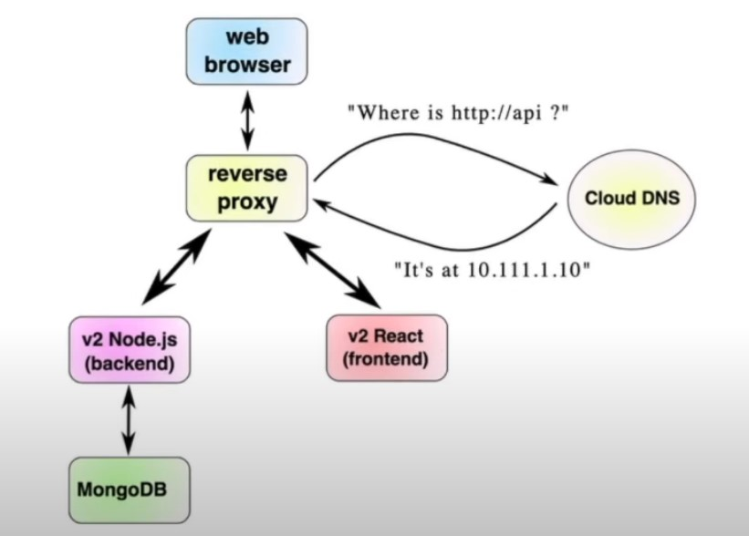

# Lesson 11: What is service discovery?

A key problem in deployment is gettin gservices to be able to find each other. A database might be at 10.1.1.1:6543 while the webserver is at 10.1.1.2:8

 

simplest MERN app

## Here, there are three services that need to be discovered:
1) The browser (end user) must learn that example.com is at some IP (10.111.1.1 for example)
1) The browser (end user) must learn that api.example.com is at some IP (10.111.1.2 for example)
1) The backend (node.js) must learn that the database is at some IP (10.111.1.3, for some example)

 

## You'll know you should care about service discovery when you start seeing one of the following:

- You want "zero downtime deployments" or to use other, more complex deployment strategies
- You have more than a couple of microservices
- You are deploying to several environments (e.g. dev/staging/ephemeral/production) and it's getting unwieldy

## The idea for a zero-downtime deployment is simple: 
1) Start the version of the backend and frontend
1) wait until the new version is up, then divert the traffic to them
1) Shut off the old version of the backend and frontend

(similar to our blue/green deployments)

user would hit the reverse proxy, which would call from v1

 

the reverse proxy would choose between v1 or v2

 

fully converted to v2

## Level 2 Service Discovery via hash table
A straightforward approach: Store the service IPs in a hash table

 

using the NGinX reverse proxy

## Problems with this approach: 
- It's complex: We've added three new dependencies that developers need to learn (nginx, etcd, and confd)
- It's error prone: It's easy to forget to update necessary keys, and it's complicated to update the keys if you are running multiple copies of each version of your services
- It requires you to write custom configuration files: It's generally nicer to use the default configuration than it is to specify your own

## Level 3 Service Discovery via DNS

## Domain Name Service (DNS) Definition
The idea for DNS is just to map hostnames to IPs. This is the industry standard

e.g. When you visit layerci.com, the global DNS system will first map the name layerci.com to the addresses (at the time of writing) 104.21.79.86 and 172.67.169.106:

When people mention DNS, they mean the global service

It'd be ideal if we could connect to "http://frontend" from our reverse proxy and have DNS respond with the IP for the correct version(s) of the frontend

Popular options:
- CoreDNS
- AWS
- Kubernetes

example DNS discovery flow

1) The user's web browser would connect to nginx thinking it was the website
1) Nginx would ask the DNS provider "where is the API right now"
1) The cloud provider would respond with "this is the address, given the deployment"
1) This would correspond with either v1 or v2 and then continue as normal

### Service discovery is tricky, but important

If you configure service discovery in an appropriate manner for your deployment (e.g. DNS-based for a kubernetes cluster), it makes it significantly easier for developers to have microservices talk to each other

Instead of a developer having to write "connect to MondoDB at 'mongodb://'+process.env["MONGODB_IP"]+':27017/myapp", they can simply say "Connect to MongoDB at 'mongodb://mongo:27017/myapp"