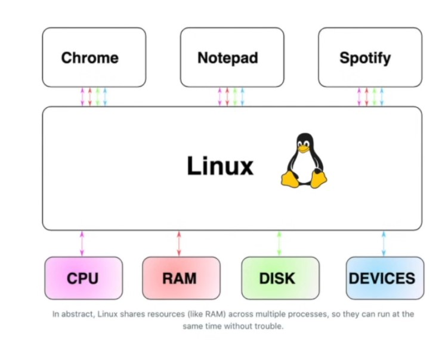
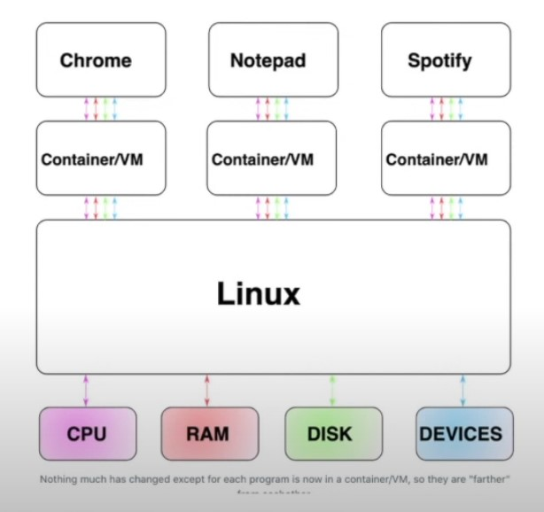

# Lesson 7: VMs vs. Containers

People usually talk about deployments through Linux

Linux keeps track of 4 things:
- Memory
    - Programs need memory to do things (RAM)
    - Which ram sticks have which programs
- CPU (processors)
    - Makes sure the right amount of processes are allocated
- Disk
    - Takes the files of all programs and allocates space on the disks for them
- Devices
    - GPU/Network Cards/etc...

Linux is allocating the shared resources

This is great, but there's too much sharing going on.

**One program could, for example, write to the file at /home/jason/file.txt and the other could read from it. A program could kill another simply by issuing a kill command.**

## Running a program in a VM or Container

The big change for moving programs into containers or VMs is that each will have its own version of shared resources like files and network ports

## How Containers Work:

Containers work by creating "namespaces", which are a Linux feature that group shared resources together. For example, if you had five processes running together within a Docker container, they'd still be running within Linux itself. 

the programs are asking "what are the contents of /usr/lib/python" and instead of answering truthfully, Linux is answering with the contents of /var/lib/docker/overlayfs/1/usr/lib/python - this little deception allows programs to run in parallel, because Linux would respond with difference files for every container. 

## How Virtual Machines (VMs) Work:

If you've ever seen older videogames running on modern computers, they're using a VM

If the idea for containers was to provide a "fake" version of Linux, the idea for Vms is to provide "fake" versions of the CPU, ram, disk, and devices, that is VMs are "faking" one level deeper. 

The VM equivalent of Docker would be a Hypervisor

**Hypervisors**: The hypervisor might "lie" to the VM and say "There is one SSD attached, it has 50gb of capacity", but the VM's writes to the "SSD", the write would instead go to a file in the host at /etc/disks/disk-1.qcow2.

## VMs vs. Containers Performance: 
- Various benchmarks show that the CPU in VMs is 10-20% slower than containers
- VMs also usually use 50-100% more storage (containers don't need all of the files the operating system would need)
- Finally, VMs use ~200mb of memory each for the 'inner operating system' whereas containers have essentialy no memory overhead

Most cases, containers are better, however

## When VMs are the better choice:
- If you are running untrested (e.g. user supplied) code, it's difficult to be confident that they can't "escape" a container. This has gotten better in recent years, but it's long been a contentious point.
- If you are running, e.g. a Windows or MacOS guest within a Linux server, you'll need to use a VM for the mentions stated above
- Finally, you can emulate hardware devices (like graphic cards) with a VM, but this is not a common use-case outside of very specific industry applications

