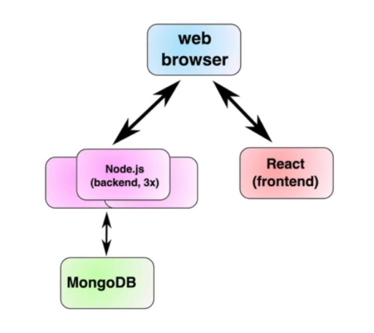
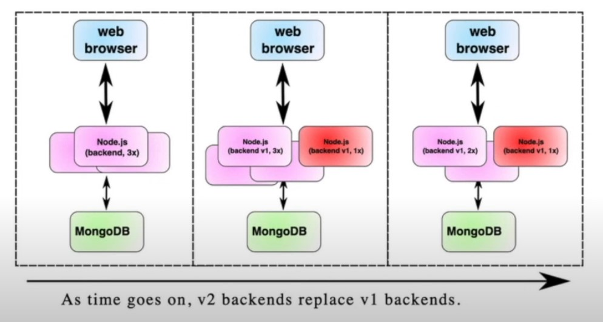

# Lesson 8: Rolling Deployments

## Rolling deployments definition: 
Strategy to deploy a new version of an application without causing downtime. They work by creating a single instance of the new version of an application, then shutting off one instance of the old version until all instances have been upgraded. 

sample MERN app

## Rolling Deployments Algorithm:

1) Create an instance of the new version of the backend
1) wait until new copy is up ('healthy')
1) Delete an instance of the old version of the backend
1) If any instances of the old version still exist, go back to step 1

example of rolling deployment

## Rolling Deployments Benefits:
- Well supported
- No huge bursts
- Easily reverted

## Rolling Deployment Cons:
- Speed
- API Compatability 

### Rolling deployments are relatively simple to understand, and generally well supported by orchestators. If your users mind when you have downtime, it's an excellent first step to start deploying using a rolling update strategy. 