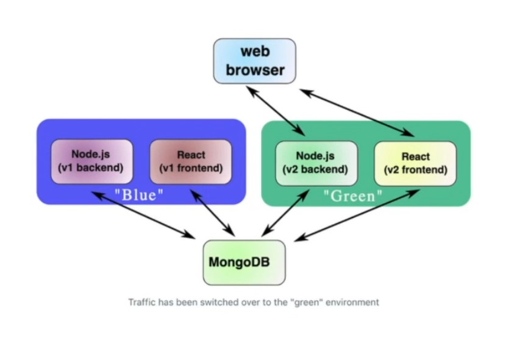

# Lesson 9: Blue/Green Deployments

## Blue/Green Deployments Definition
Strategy to deploy a new version of an application. They work by starting an entirely new instance of the application and then routing traffic over to it. 

users are taken to the "blue" deployment, all the while sharing the same database as the "green" deployment

users are then taken to the "green" deployment

## Blue/Green Deployment Benefits:
- Easy to understand
- Powerful
- Extendable to workflows

## Blue/Green Deployment Cons:
- Difficult to make hotfixes
- Resource allocation is not convenient 
- Clusters can affect each other

## Rainbow Deployments

Have more than the two deployment clusters (blue/green). Instead, teams have many clusters ready (blue/green/yellow/red etc...)

In a rainbow deployment, old clusters would only be shut off after all of their long-running jobs were done processing. 

## Acceptance Tests

New version of the app could be tested against the production database in the very environment which will soon become production.

QA and product stakeholders can choose to "accept" the dev team's latest release.

## Canary Deployments

In the context of blue/green deployments, a "canary deployment" would be to route around 5% of your users at random to the new cluster, and check that those users do not have negative feedback before switching the rest of the users over. 

## Blue/green deployments are a powerful and extensible deployment strategy that works well with teams that are deploying a few times per day. The strategy only starts being problematic in continuous deployment scenarios where there are many servives being deployed many times per day. 

### [Timestamped link to setting up continuous deployment](https://youtu.be/j5Zsa_eOXeY?t=5733)