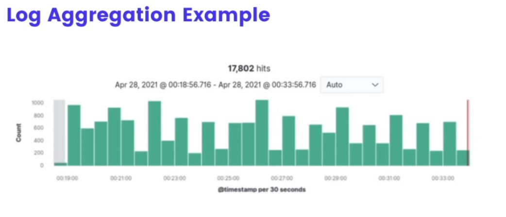

# Lesson 12: What is log aggregation?

## Application Performance Management

## Log Aggregation Definition
It's a way of collecting and tagging application logs from many differenct servives into a single dashboard that can easily be searched. 

## Essence of a good log aggregation platform:
Efficiently collect logs from everywhere that emits them, and make them easily searchable in case of a fault.

## 3 components of a Log Aggregation Platform:
1) The log processor (Logstash)
2) The data store (Elasticsearch)
3) The log frotnend (Kibana)

**DataDog** is an example of a log aggregation platform

## Log aggregation is a key tool for diagnosing problems in production. It's relatively simple to install a turnkey solution like ELK or CloudWatch into a production system, and it makes diagnosing and triaging problems in production significantly easier